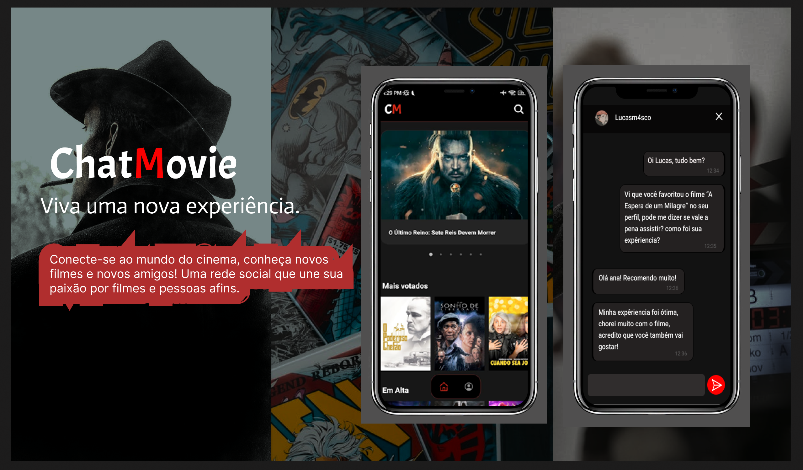

# ChatMovie

## Sobre o projeto

O projeto pessoal ChatMovie é um aplicativo que permite que os usuários pesquisem e visualizem informações sobre filmes. Além disso, o aplicativo oferece recursos adicionais para usuários cadastrados, como personalizar seus perfis, adicionar amigos, favoritar filmes e criar um chat em tempo real com outros usuários.

## Tecnologias

As principais tecnologias usadas para o desenvolvimento desse aplicativo foram:

- Node.js e Express para o backend do aplicativo.
- React Native / Expo para o front mobile.
- MongoDB para o armazenamento de dados.
- WebSockets para chat em tempo real.

## Como executar

Para executar em sua máquina o projeto, verifique as seguintes configurações do ambiente:

- [Configurar o backend da aplicação](./backend/README.md#como-executar)
- [Configurar o frontend da aplicação](./chatmovie/README.md#como-executar)
