# ChatMovie - Front

Nesta seção você terá uma melhor introdução sobre a parte visual da aplicação

## Apresentação de algumas bibliotecas 

Para a criação do front desse aplicativo, estive utilizando algumas ferramentas e bibliotecas que auxiliam o desenvolvimento, algumas delas foram:

- `@react-navigation`: Biblioteca usada para criar e gerenciar rotas no desenvolvimento mobile.
- `react-redux` e `@reduxjs/toolkit`: Gerenciamento de estados de variáveis com escopo global.
- `axios`: Realizando requisições para a API do TMDB e para o backend da aplicação.
- `crypto-js`: Biblioteca para uso em criptografias e descriptografias, utilizei na descriptografia de mensagens recebidas e enviadas.
- `expo-secure-store`: Armazenamento seguro de dados locais.
- `styled-components`: Criação de componentes estilizados usando a sintaxe do CSS.

## Telas do projeto

1. Telas não autenticadas:

    - Tela de abertura:

        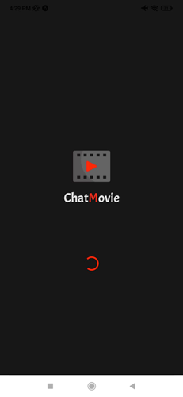

    - Tela inicial

        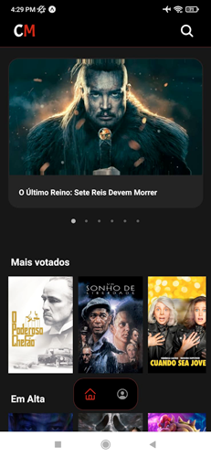

    - Tela de detalhes sobre os filmes

        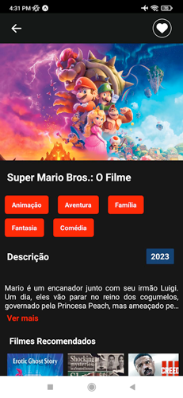

    - Tela de login

        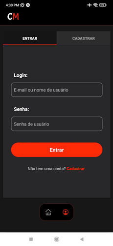

    - Tela de cadastro

        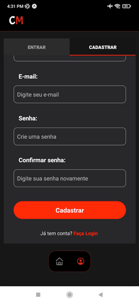

2. Telas autenticadas:

    - Tela perfil

        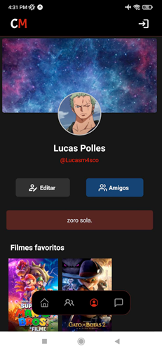

    - Tela para editar perfil:

        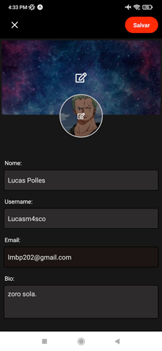

    - Tela listando usuários:

        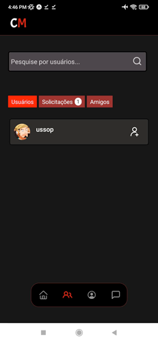

    - Tela com solicitações de amizades:

        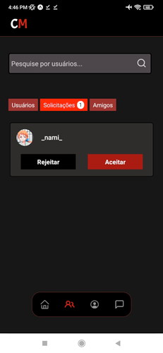

    - Tela amigos:

        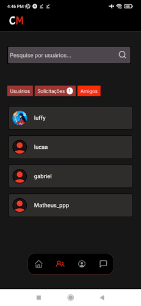

    - Tela com perfil de um usuário:

        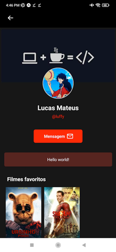

    - Tela do chat em tempo real:

        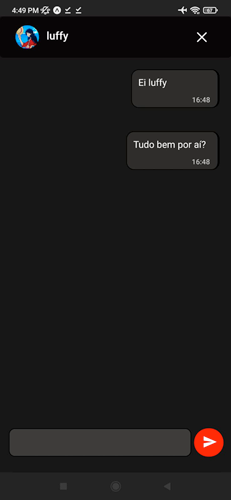

    - Tela mensagens atuais:

        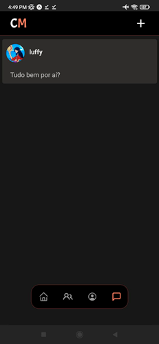


## Como executar

Para o funcionamento correto sobre o aplicativo, recomenda a configuração e inicialização do back-end primeiro, após isso você pode seguir os seguintes passos:

1. Definindo as variaveis de ambiente necessárias:

    - Crie um arquivo nomeado `.env` na pasta atual.
    - Crie uma conta no [TMDB](https://www.themoviedb.org) para poder acessar a sua chave da API.
    - Dentro do arquivo `.env` defina a seguinte estrutura:

    ```dotenv
    API_KEY_TMDB=sua-chave-da-API
    ```

2. Instale as dependências do projeto:

    - Abra o seu terminal e navegue até a pasta atual do projeto.
    - Execute o comando ```npm install``` para instalar as dependências necessárias.
    - Caso não possua a ferramenta **expo** em sua máquina ou celular, você pode estar vendo como instalar no site oficial deles: [instalando Expo](https://docs.expo.dev/get-started/installation/).

3. Executando aplicação:

    - Após instalar as dependências, utilize o comando ```npm start``` ou ```npx expo start```.
    - O comando acima vai inicializar sua aplicação e gerar um QR Code, você pode estar rodando a aplicação em seu celular através do aplicativo Expo Go e realizando a leitura desse QR Code.